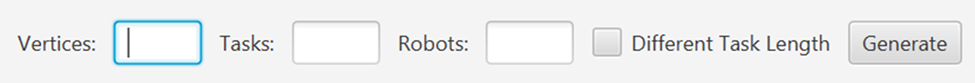
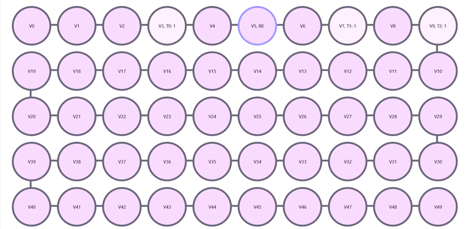

# Collision-Free Robot Scheduling

## Introduction

Nowadays, robots are increasingly used in laboratory environments. This article examines how to properly schedule assigned tasks in the case of multiple fixed-position robots, in order to ensure that a robot performing task X does not block another robot performing task Y.

To illustrate this, a graph needs to be created where:
- Nodes represent the tasks to be completed by the robots.
- Each node can be occupied by exactly one robot at a time.
- Every robot must have a “schedule” that defines where it is located on the graph at any given time.
- If a robot occupies a node, it must remain there for at least the duration of the task.
- Moving between two nodes takes time; however, robots are allowed to wait at a node after completing a task.
- Each robot is only required to complete the tasks specifically assigned to it.

The goal of the algorithm is to determine a “schedule” for each robot that allows all robots to complete their tasks in as few steps as possible, minimizing the total time until the last robot finishes.
Each robot will have its own schedule, which consists of time steps and the corresponding occupied positions.

## Algorithm

### 1 Robot
A single robot has to complete multiple tasks located on a path graph. Since it can move in two directions, we check which direction has the farthest task that is closer to the starting point. The robot moves in that direction, completes the tasks in order (based on their position on the graph), and finishes all assigned tasks.

### 2 Robots
When two robots are used, we divide the tasks between them. Tasks located between the two robots are split in a way that minimizes the total completion time. After the assignment, each robot completes its own set of tasks.

### n Robots
For more than two robots, we use a dynamic algorithm to assign tasks in an optimal way. Each robot then completes the tasks assigned to it based on the scheduling result.

## Implementation

The project is implemented in Java, using JavaFX for the graphical user interface and Maven as the build and dependency management tool.
### Program Overview
The program implements the only type of graph for which an optimal schedule can be determined: a path graph, where the distances between adjacent nodes are equal. Based on the parameters entered by the user, the program generates a path graph, places the robots and the tasks on its nodes, and runs the scheduling algorithm.

After generation, the user can step through the execution of the algorithm to see, for each step, which robot is moving, how long it takes, and the path it follows to complete its assigned tasks.

At the end of execution, the program summarizes the results. It only visually displays the longest schedule, but creates a log file containing the full path and schedule for each robot for traceability.

### Input Parameters
The user provides four integer inputs:
- Number of Nodes: The number of nodes in the path graph where robots and tasks can be placed.
- Number of Tasks: The number of tasks to be performed. This must not exceed the number of nodes.
- Number of Robots: The number of robots placed on the graph. This must also not exceed the number of nodes.
- Variable Task Duration: A boolean value that defines whether tasks have fixed (1 unit) or variable durations.

### Example
For example, with the following inputs:
- 50 nodes
- 3 tasks
- 1 robot
- Fixed task duration

The nodes are placed from v0 to v49. Nodes with tasks are displayed with a lighter background color, while the others use a darker background. The robot’s starting position (e.g., v5) is highlighted with a distinct border. The algorithm can be stepped through by pressing a button to progress to the next iteration.

## Structure